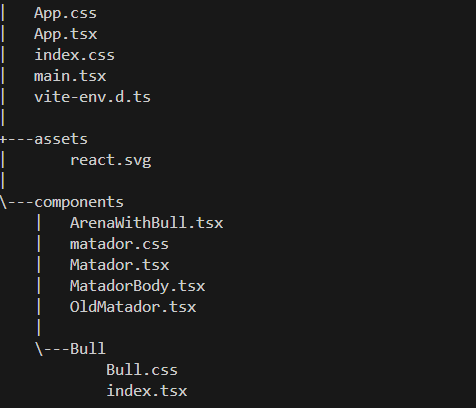

Description
This project implements an interactive Matador for an arena, created using React. The component responds to events such as bull movements or audience applause. It adjusts the Matador's position on the arena based on the bull's behavior and demonstrates various types of reactions to events.

Features

Interactivity:

The Matador changes its position if the bull appears in the same cell.

Displays a movement message that remains visible for 5 seconds.

Reaction to Applause:

Plays sounds based on the type of applause.

Reacts only to applause type changes to avoid unnecessary renders.

Render Optimization:

The component is optimized using React.memo to prevent unnecessary re-rendering.
